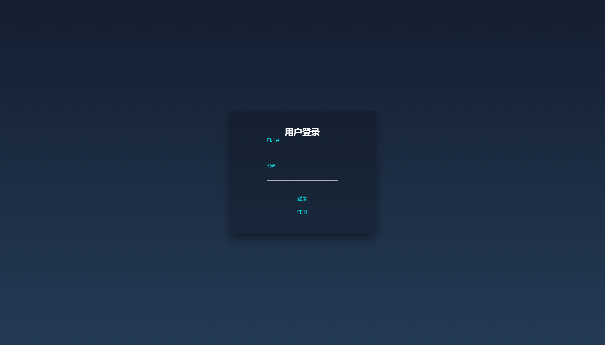
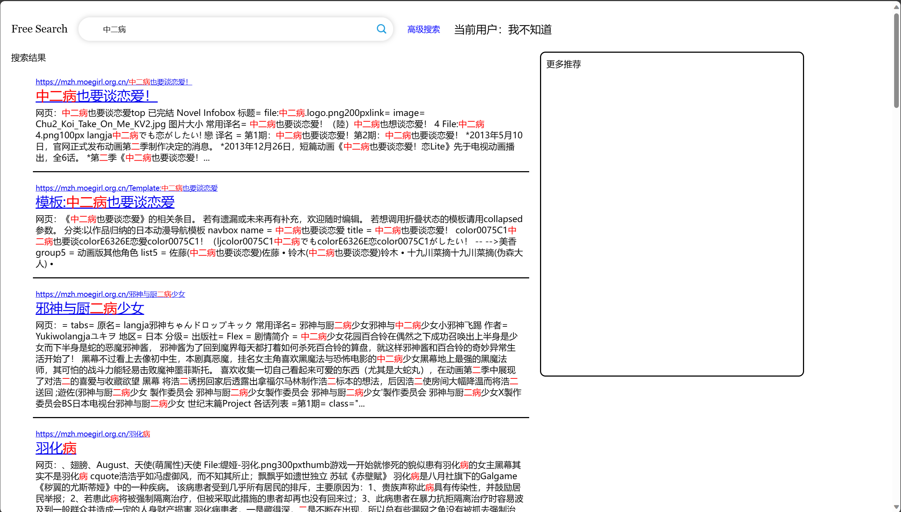
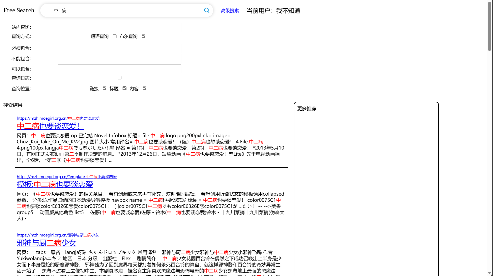
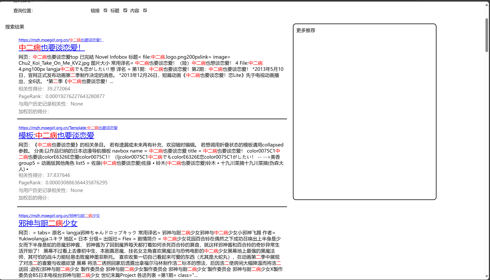

# 搜索引擎设计

## 搜索引擎简介

我们搜索引擎的主题为二次元，主要为了进行动漫、`Galgame`的检索。

## 前期准备

安装`ElasticSearch`，修改配置文件，将两个`enabled`项改为`false`：

```yaml
# Enable encryption for HTTP API client connections, such as Kibana, Logstash, and Agents
xpack.security.http.ssl:
  enabled: false
  keystore.path: certs/http.p12

# Enable encryption and mutual authentication between cluster nodes
xpack.security.transport.ssl:
  enabled: false
  verification_mode: certificate
  keystore.path: certs/transport.p12
  truststore.path: certs/transport.p12
```

重设密码：

```shell
elasticsearch-reset-password -u elastic
```

安装中文分词插件：

```shell
elasticsearch-plugin install https://github.com/medcl/elasticsearch-analysis-ik/releases/download/v8.11.1/elasticsearch-analysis-ik-8.11.1.zip
```

## 文本抓取

我们爬取的站点为[萌娘百科](https://mzh.moegirl.org.cn/)，我们通过两种方式爬取页面。

### 随机爬取

该站点提供了一个[随机条目](https://mzh.moegirl.org.cn/index.php?title=Special%3ARandom&utm_source=moe_homeland)的链接，可以跳转到随机一个词条。我们使用`selenium`从该方式爬取了1000条条目。由于该方式爬取的条目太过于随机，关联性较低，我们并没有爬取过多的页面。

### 通过页面爬取

通过观察我们可以发现，萌娘百科首页提供了以下三个链接较多的页面：[动画公司](https://mzh.moegirl.org.cn/index.php?utm_medium=simple_list&title=Template%3A%E5%8A%A8%E7%94%BB%E5%85%AC%E5%8F%B8&utm_source=moe_homeland)、[Galgame公司](https://mzh.moegirl.org.cn/index.php?utm_medium=simple_list&title=Template%3AGalgame%E5%85%AC%E5%8F%B8&utm_source=moe_homeland)。于是，我们以这两个链接为根，进行后续的三次爬虫：

+ 第一次爬虫：在这两个页面爬取公司信息，获取了465个有效的链接。
+ 第二次爬虫：在公司页面爬取各公司的作品链接，获得了四万多条链接。
+ 第三次爬虫：过滤有效链接，得到15963条有效链接，分别爬取，保存页面内容、链接、锚文本等。

下面我们具体详解爬取过程。

#### 爬取内容的保存

在开始爬虫之前，我们需要设计爬取内容的结构，我们使用`dict`保存页面信息，以`url`作为键，保存`url`、锚文本、标题、页面、`pageRank`。例如：

```python
"https://mzh.moegirl.org.cn/Template:Galgame公司": {
    "url": "https://mzh.moegirl.org.cn/Template:Galgame公司",
    "anchor_text": [],
    "title": "模板:Galgame公司",
    "page": 1701530247,
    "page_rank": 0
}
```

我们将爬取到的页面保存为文本文件，文件名使用当时的时间戳。

#### 爬取链接

由于我们需要爬取的页面为动态加载内容，所以我们使用`selenium`爬取页面。获取页面后，定位所有`a`标签，保存链接：

```python
link_elements = driver.find_elements(By.TAG_NAME,"a")
```

之后遍历链接，保存有效链接。由于`selenium`无法获取响应状态码，所以我们使用`requests`获取爬取页面响应状态码，如果页面不存在，即响应码不为200，则继续下一条：

```python
try:
    resp = requests.get(url=one_url,headers=request_headers)
except:
    continue
if not resp.status_code == 200:
    urls_not_found.add(one_url)
    continue
```

#### 过滤链接

由于爬取到的部分链接是无效链接或者重复链接，所以需要对其进行两次过滤。

第一次过滤，将链接与参数分离，链接部分相同的视为同一个链接：

```python
for key,value in url_info.items():
    res = re.split('[#?&]', key)
    if len(res) == 0:
        url_info_new[key] = value
    else:
        url_info_new[res[0]] = value
        url_info_new[res[0]]["url"] = res[0]
```

第二次过滤，使用正则表达式过滤无效的链接，比如访问的是图片或者访问的内容不是正常的链接：

```python
url_filter = [
    r"https://mzh.moegirl.org.cn/Special:.*", 
    r"https://mzh.moegirl.org.cn/index.php?title=.*", 
    r".*\.jpg", 
    r".*\.png", 
    r"https://mzh.moegirl.org.cn/萌娘百科:.*",
    r"https://mzh.moegirl.org.cn/萌娘百科_talk:"
    ]

keys = list(url_info.keys())

for key in keys:
    for i in url_filter:
        if re.match(i, key):
            m = url_info.pop(key)
```

#### 爬取文本

由于萌娘百科是基于维基百科的方式建立的，所以可以在正常的`url`后加上参数`action=raw`，这样使用`requests`爬取得到的页面为原始页面。之后需要删除页面中的特殊字符和一些维基百科标记。但是这样爬取的页面中没有链接信息，所以仍然需要`selenium`获得页面中的链接，将其过滤后保存为文件。

#### 断点保存

由于不能保证爬虫过程顺利进行，我们在每爬取1000个页面时保存一次链接信息，将其导出为`json`文件。

## 链接分析

由于构建索引时需要将其保存到搜索引擎中，所以我们在此之前进行链接分析，省去更新文档的麻烦。

使用`pageRank`算法计算各页面的`pageRank`值，我们采取稀疏矩阵的计算方式计算该值。

在我们使用的`pageRank`算法中，我们规定用户在进入一个页面中，继续点击当前页面的链接的概率为`0.85`，跳转到其他页面的概率为`0.15`。使用如下方法计算：

```python
for i in range(iter):
    for key, value in id_graph.items():
        if len(value) == 0:
            continue
        step = curr_pageRank[key] / len(value)
        for i in value:
            next_pageRank[i] += step

    curr_pageRank = next_pageRank
    next_pageRank = [0] * link_num
    for i, n in enumerate(curr_pageRank):
        curr_pageRank[i] = curr_pageRank[i] * p + (1 = p) / link_num
```

计算完毕后将其保存到`json`文件中。

## 索引构建

我们使用`elasticsearch`构建索引，使用`ik_max_word`作为分词方式，该方式会将一句话中中文可能组成的词语全部列出。

我们对url、锚文本、标题、文本四个部分均进行分词，之后构建索引。配置参数为：

```pyhton
doc = {
    'settings': {
        'analysis': {
            'analyzer': 'ik_max_word',
            "search_analyzer": 'ik_max_word'
        }
    },
    'mappings':{
        'properties':{
            'url':{
                'type': 'text',
                'analyzer': 'ik_max_word',
            },
            'anchor_text':{
                'type': 'text',
                'analyzer': 'ik_max_word',
            },
            'title':{
                'type': 'text',
                'analyzer': 'ik_max_word',
            },
            'content': {
                'type': 'text',
                'analyzer': 'ik_max_word',
            }
        }
    }
}
```

之后遍历页面字典，分别构建索引，使用页面对应的文件名作为`id`：

```python
test = list(url_info.keys())
for url in test:
    test = url_info[url]

    with open('new_pages/' + str(test["page"]), 'r', encoding='utf-8') as f:
        test["content"] = f.read()

    res = es.index(index='index', id=test["page"], body=test)
```

## 用户登陆

我们实现了一个极为简单的用户注册登录系统，使用`json`存储用户名、密码和点击历史，用户注册时将用户名和密码存入`json`文件中，历史记录设为空列表。例如：

```python
[
    {
        "name": "b",
        "password": "aaa",
        "history": [
            "1701519566",
            "1701519566",
            "1701576109",
            "1701519566",
            "1701535551"
        ]
    }
]
```

## 基本搜索

我们首先定义各个字段的权重：

```python
field_boost = {"url":2, "title":2, "anchor_text":2, "content":1}
```

前端将搜索关键词传给后端，使用最基本的多字段匹配的方式查询，按照默认的得分进行排序，前后添加高亮标签：

```python
    query = {
        "query": {
            "multi_match": {
                "query":key,
                "fields":[
                    f"url^{field_boost['url']}",
                    f"title^{field_boost['title']}",
                    f"content^{field_boost['content']}",
                    f"anchor_text^{field_boost['anchor_text']}"
                ]
            }
        },
        "highlight": {
            "pre_tags" : ["<font color='red'>"],
            "post_tags" : ["</font>"],
            "fields" : {
                "title" : {},
                "url" : {},
                "content" : {}
            }
        },
        "from": 0,
        "size": 30,
    }
```

将查询结果整理为`json`格式后发送给前端。

## 个性化查询

个性化查询需要考虑搜索结果与用户历史记录的相关性，我们使用向量空间模型计算两个文档的相关性。

前端需要向后端发送搜索关键词和用户名，搜索引擎进行搜索之后返回结果，将返回结果整理成我们需要的格式。

使用`termvectors`查询，获取文档内容和用户历史记录的分词结果，查询方式如下：

```python
tv_query = {
    "fields" : ["content"],
    "offsets" : False,
    "payloads" : False,
    "positions" : False,
    "term_statistics" : False,
    "field_statistics" : False
}
```

遍历查询得到的文档，计算与历史记录中的各个文档的向量夹角余弦值，取余弦值最高的为与用户历史的相似度：

```python
for info in data:
    tv = es.termvectors(index="index", id=info["id"], body=tv_query)
    tvt = tv["term_vectors"]["content"]
    tvt["len"] = get_len(tvt)
    inner = [get_inner_product(tvt, i) for i in history_terms]
    info["sims"] = max(inner)
```

我们现在有了三个排序依据：与查询的相关性得分、`pageRank`得分和与用户历史的相关性，我们将三者分别进行归一化后加权平均，作为排序的依据：

```python
sort_weight = {"score":0.4, "page_rank":0.4, "sims": 0.2}
for key in sort_weight.keys():
    max_value = max(data, key=lambda x:x[key])[key]
    min_value = min(data, key=lambda x:x[key])[key]
    for entry in data:
        if max_value == min_value:
            entry[key + "_standard"] = 1
        else:
            entry[key + "_standard"] = (entry[key] - min_value) / (max_value - min_value)
for entry in data:
    entry["weighted_score"] = 0
    for key, value in sort_weight.items():
        entry["weighted_score"] += entry[key+"_standard"] * value
data.sort(key=lambda x:x["weighted_score"], reverse=True)
```

## 高级搜索

### 站内搜索

在搜索到结果后，使用正则表达式过滤url信息，将过滤后的结果发送给前端：

```python
if data["site"] != "":
    ret = list(filter(lambda x:re.match(data["site"] + ".*", x["url"]), ret))
```

### 短语查询

使用布尔查询的方式，对不同字段进行短语查询：

```python
    if data["queryType"] == "match_phrase":
        query["query"] = {"bool":{"should":[]}}
        for field in data["field"]:
            query["query"]["bool"]["should"].append({"match_phrase": {field:data["key"]}})
```

生成的查询形如：

```python
{
    "query": {
        "bool": {
            "should": [
                {"match_phrase": {"url": "zero"}},
                {"match_phrase": {"title": "zero"}},
                {"match_phrase": {"content": "zero"}},
            ]
        }
    },
    "highlight": {
        "pre_tags": ["<font color='red'>"],
        "post_tags": ["</font>"],
        "fields": {"title": {}, "url": {}, "content": {}},
    },
    "from": 0,
    "size": 30,
}
```

### 布尔查询

布尔查询分为必须包含、不能包含、和可以包含。我们会将三种输入的文本按照空格分割，之后也是使用循环的方式构建查询：

```python
elif data["queryType"] == "bool":
    query["query"] = {"bool":{}}
    boolFilter = data["boolFilter"]
    for key,values in boolFilter.items():
        if len(values) != 0:
            query["query"]["bool"][key] = []
            for value in values:
                for field in data["field"]:
                    query["query"]["bool"][key].append({"match_phrase": {field:value}})
```

由于构建出的查询较为复杂，在此不做展示。

### 查询日志

在后端为前端返回数据时，将相关性得分、`PageRank`、与用户历史记录的相关性、加权后的得分返回给前端，如果用户勾选查询日志选项，则将其展示在页面中。

### 查询位置

给用户提供三个位置：链接、标题和内容，用户勾选即可修改搜索范围。在处理高级搜索时，将`data["field"]`项设置为勾选列表，后续构建索引时按照该列表构建多字段索引即可。

## 个性化推荐

使用`MLT`的查询方式，查询与用户历史记录中的文本项，在返回结果中不返回文本内容（因为不需要展示出来）：

```python
likes = []
for i in history:
    likes.append({"_index": "index", "_id": i})
query = {
    "query": {
        "more_like_this": {
            "fields": ["content"],
            "like": likes,
            "min_term_freq": 1,
            "max_query_terms": 10
        }
    },
    "_source": {
        "excludes": ["content"]
    }
}
res = es.search(index='index', body=query)
```

## 可视化界面

我们使用`django`框架作为项目主体部分。前后端交互使用`ajax`的方式发送请求，减少刷新页面次数。

当访问搜索引擎时，默认先跳转到用户登录界面：



当我们注册并登录用户`我不知道`后，会进入搜索页面：


当我们搜索`中二病`时，会跳转到搜索结果展示页面，搜索页面会展示url、标题和网页内容：



由于该用户历史记录为空，所以没有推荐内容。

点击高级搜索还可以进行高级搜索：



如果勾选查询日志，还可以显示详细信息，由于这里没有用户历史记录，所以部分项没有值：



更详细的操作见演示视频。

